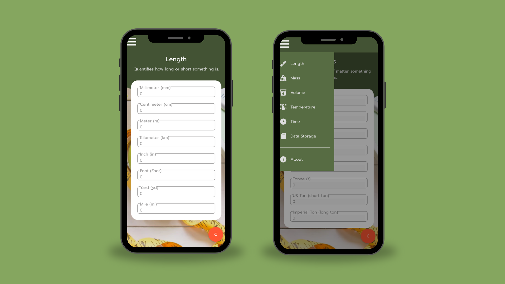

# UnitConv
UnitConv is a free unit converter hybrid mobile application for android.

## Table of Contents

- [Image](#image)
- [Downlaod](#download)
- [Features](#features)
- [Technologies](#technologies)

## Image

## Download

Here are the following download links for UnitConv.

- [Google Drive](https://drive.google.com/file/d/18o41YBrojBbTMN1ryRs7Cgvos-1yPdPP/view?usp=drive_link)
- [MediaFire](https://www.mediafire.com/file/vpnsimteqd2dwjm/UnitConv.apk/file)
- [Dropbox](https://www.dropbox.com/scl/fi/ahmt228yrqhdlzjoptz8b/UnitConv.apk?rlkey=xskgd630vmzels8fjqwceztlu&dl=0)

## Features

The application can convert the following units of measurement:

- Length
- Mass
- Volume
- Temperature
- Time
- Data Storage

## Technologies

I used the following technologies to develop UnitConv.

- HTML
- CSS
- JavaScript
- [Visual Studio Code](https://code.visualstudio.com/)
- [DroidScript](https://droidscript.org/#)
